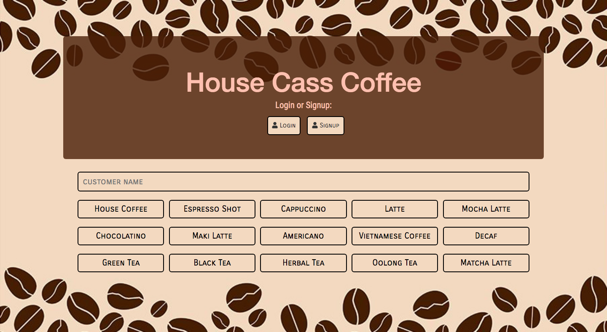
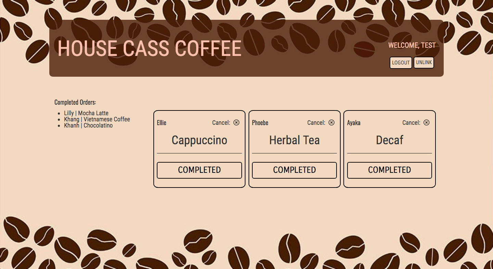

# Barista Full-stack App

### Goal: Create an app that enables the cashier to enter the customer's name and their coffee order. Then add that order to a queue that the baristas can see and give them the ability to mark an order complete. Completed orders should show which barista completed the order and have their own list. App automatically says the customer's name out loud when an order is complete.

## Design and Development:
**Tech Used** HTML, CSS, JavaScript, Node, Express, EJS template, MongoDB, User Authentication

## Reflections:
Fun app to build. Next time (when not on a time constraint) I would try to create a more complex POS on the cashier's screen so they can add in multiple orders or add details on the ticket.

## Installation
1. Clone repo
2. run `npm install`

## Usage
1. run `node server.js`
2. Navigate to `localhost:3330`

## Credit
Modified from Scotch.io's auth tutorial

## Important
create database.js file with:

module.exports = {
    'url' : '<db connect link>', // looks like mongodb://<user>:<pass>@mongo.onmodulus.net:27017/Mikha4ot
    'dbName': '<yourDbName>'
};
